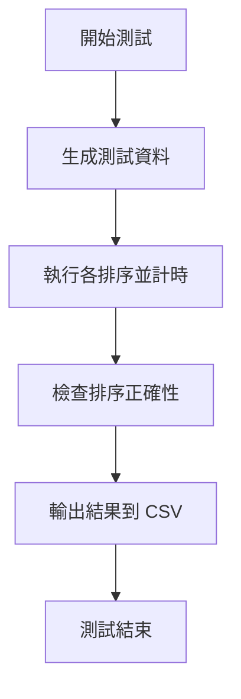

# 41343127
---
# 41343150
---

## 解題說明
---
在這份專案中，我們使用 C++ 實作了多種排序演算法，並在不同輸入情況下測量其效能。為了結構化程式，我們將各排序演算法（如插入排序、快速排序、合併排序、堆積排序與複合排序）的實作分別放在不同檔案（分別為 `insertion_sort.cpp`、`quick_sort.cpp`、`merge_sort.cpp`、`heap_sort.cpp`、`composite_sort.cpp`），而產生測試資料的功能放在 `generator.cpp`，計時功能放在 `timer.cpp`。主要的 `benchmark.cpp` 則整合這些元件，針對不同資料大小及案例（已排序、反向排序或隨機排列）執行排序並記錄耗時。

本作業重點是比較多種排序法在**最壞情況**和**平均情況**下的時間差異。舉例來說，插入排序在最壞情況（資料完全反向）下時間複雜度為 $O(n^2)$，而快速排序和合併排序則可達 $O(n \log n)$。透過本專案，我們可實際觀察這些理論差異在不同資料量時的影響。最終結果輸出為 `result.csv`，後續可利用繪圖軟體將結果視覺化。

這是由我們兩人共同完成的大學資料結構課程作業，透過實作與測試加深對各種排序法特性的理解。

## 解題策略
我們的程式主要流程如下：

- **資料生成**：`generator.cpp` 中提供了多種生成函式，可產生已排序、反向排序和隨機排列的整數陣列。對於特定最壞情況，我們針對合併排序實作了特殊最差案例產生函式（模擬分割不均的情境）。
- **複製陣列**：為了確保每種排序演算法都操作相同的輸入資料，執行排序前會先複製一份原始陣列。這樣做可以避免先前排序改變資料而影響後續測試。
- **執行排序並計時**：針對每種排序方法，我們利用 `timer.cpp` 提供的 `getElapsedTime` 函式，在排序前後記錄時間差。排序演算法函式（插入、三分位元快速、迭代合併、堆積、複合）會直接作用於陣列，上述流程由 `benchmark.cpp` 統籌呼叫。
- **組合排序策略**：`compositeSort` 函式是一種混合演算法，對於較小的陣列（小於設定門檻）採用插入排序，以減少遞迴開銷；對於較大的陣列則使用三分位元快速排序，以加速排序過程。
- **結果檢查**：排序完成後會呼叫 `checkSorted` 函式確認陣列是否已正確排序，以確保演算法實作正確無誤。
- **數據收集**：每次測試後將資料大小與排序耗時寫入 `result.csv`。`benchmark.cpp` 採用迴圈依序處理不同的 N 值（例如 500、1000、2000、…、5000），並針對最壞情況與平均情況兩種資料分別執行，以完整蒐集效能數據。

以上步驟確保我們對每個排序演算法在不同測試情境下都能公平測試並記錄時間，方便後續進行效能分析與比較。

## 效能分析
排序演算法的時間與空間複雜度如下表所示：  

| 排序演算法       | 平均時間複雜度    | 最壞時間複雜度    | 空間複雜度 |
|---------------|--------------|--------------|---------|
| 插入排序         | `O(n^2)`     | `O(n^2)`     | `O(1)`  |
| 三分位元快速排序 | `O(n log n)` | `O(n^2)`     | `O(log n)` |
| 迭代合併排序     | `O(n log n)` | `O(n log n)` | `O(n)`  |
| 堆積排序         | `O(n log n)` | `O(n log n)` | `O(1)`  |
| 複合排序         | `O(n log n)` | `O(n^2)`     | `O(n)`  |

由理論可知，插入排序的複雜度為二次成長，對大規模資料會非常緩慢；快速排序和合併排序平均上屬於 `O(n log n)`，執行時間增長較平緩。複合排序在實作上對小輸入使用插入排序，因此可縮短小規模的開銷；對大輸入則仍維持快速排序的效率。實驗結果符合這些預期：隨著資料量增加，插入排序的耗時曲線明顯較陡峭，而快速排序、合併排序與堆積排序的耗時變化較平穩，複合排序通常在中等到大型資料下速度最佳。

以下是 `result.csv` 的部分範例（示意）：  
```csv
排序方法,資料大小,Worst(秒),Average(秒)
InsertionSort,5000,0.0143,0.0099
QuickSort,5000,0.00046,0.00049
MergeSort,5000,0.00068,0.00072
HeapSort,5000,0.00123,0.00130
CompositeSort,5000,0.00050,0.00053
```  
從此表可看出，當資料大小為 5000 時，插入排序的耗時遠高於其他方法（毫秒級），而快速排序和複合排序的平均耗時接近，顯示它們的效能表現優異。這些數據可用來繪製折線圖或長條圖，以視覺化比較各排序法的表現差異。

## 測試與驗證
為了驗證各排序法的正確性與測試架構的完整性，我們在實作中使用了多種測試資料，包括：  

| 測試案例   | 資料示例                    |
|----------|--------------------------|
| 已排序    | {1, 2, 3, 4, 5}          |
| 反向排序  | {5, 4, 3, 2, 1}          |
| 隨機排列  | {8, 3, 5, 1, 9, 2, 7, 4, 6} |
| 重複元素  | {5, 1, 3, 5, 2, 1, 4, 3} |
| 包含負數  | {-3, 5, 0, -1, 2, -5, 4} |

我們對上述範例與多組隨機資料進行排序，並使用 `checkSorted` 函式檢查結果是否為升序。所有排序方法都通過了基本正確性測試。

實際測試時，`benchmark.cpp` 迴圈中採用多組資料大小（如 500、1000、2000 … 5000），針對每種情況重複執行排序並記錄時間。下圖為測試流程示意：  



上述流程確保每個排序方法在不同的測試情境與資料量下都被執行與驗證，可得到完整的效能數據。

## 結論
本專案驗證了不同排序演算法在各種情境下的效能差異：隨著資料量增加，插入排序耗時以二次曲線大幅上升，表現最差；快速排序、合併排序與堆積排序則維持近 `O(n log n)` 的增長，曲線較為平滑。實驗中複合排序通常有最佳效能，因為它結合了插入與快速排序的優點，對小陣列加速且對大陣列效率高。

建議繪製折線圖以更直觀呈現結果：橫軸為資料規模 `N`，縱軸為耗時，分別畫出每種排序法的曲線。從圖中可清楚比較不同演算法隨輸入大小的效能差異，例如插入排序曲線最陡峭、複合排序曲線最低。此外，也可針對最壞情況與平均情況分別繪圖，強調各排序法在不同情境下的差別。

整體而言，此專案達到了預期目標：實作了多種排序演算法並分析其效能，使我們更了解各方法的特性與適用情境。

## 申論及開發報告
- **工作分配**：本專案由兩人合作完成，我們決定分工執行：一人負責實作插入排序和合併排序，另一人負責快速排序、堆積排序與複合排序。測試資料生成和效能記錄部分則共同維護，以利程式整合。
- **編譯與執行**：程式使用 C++17 編譯（例如 `g++ -std=c++17`），需要將主程式 `benchmark.cpp`、`timer.cpp`、`generator.cpp` 以及所有排序演算法的 `.cpp` 檔案一起編譯。例如：  
  ```bash
  g++ -std=c++17 src/benchmark/benchmark.cpp src/benchmark/timer.cpp src/generator/generator.cpp \
      src/sorting/insertion_sort.cpp src/sorting/quick_sort.cpp src/sorting/merge_sort.cpp src/sorting/heap_sort.cpp src/sorting/composite_sort.cpp \
      -o sorting_project
  ```  
  執行 `./sorting_project` 即可開始測試。
- **注意事項**：`timer_test.cpp` 只用於獨立測試計時功能，請勿與 `benchmark.cpp` 同時編譯（否則會有兩個 `main` 函式衝突）。程式中使用了 `<chrono>` 計時庫，因此編譯時請開啟 C++11 以上標準，並確認程式開頭以 `using namespace std::chrono;` 引入時間函式。
- **問題與限制**：由於隨機資料使用標準庫亂數產生，測試結果可能因每次執行的隨機性而略有差異；排序耗時也會因硬體差異而不同。此外，複合排序的切換門檻值是手動設定的，可根據實際情況調整，但本作業中使用的是預設值。
- **成果反思**：兩人合作使工作分配更有效率，我們在實作中學到了如何整合多個功能模組並處理編譯與測試中的問題。整體而言，專案執行順利並達到預期目標，後續可在此基礎上進一步優化或擴充功能。
